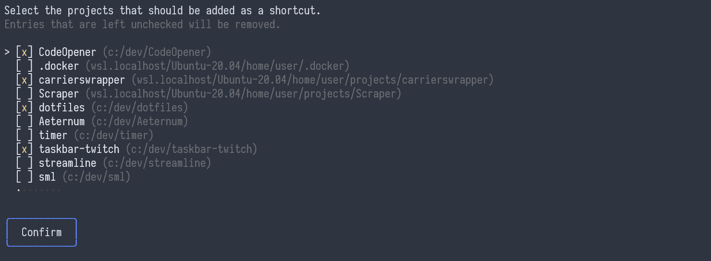

# Code Opener

## Overview

Command line utility that creates (windows menu) shortcuts to VSCode (or VSCodium) projects.

It is useful for handling a lot of projects and quickly opening them through shortcuts.



The utility keeps track of every project that was opened in the past and displays them as entries.
This is useful as you can then just type the project name in the windows menu search to quickly open it.


## Install

Two options:
1. Build from source (requires the `go` compiler)

Clone the repository and run:

```
go build -o CodeOpener.exe .\src
```

2. Use an existing build

Go to the [releases](https://github.com/HazyAlex/CodeOpener/releases) page and download the latest executable.

## Usage

Simply run the executable with the name of the editor.
<br><br>

- VSCode

```
.\CodeOpener.exe vscode
```

- VSCodium

```
.\CodeOpener.exe vscodium
```
